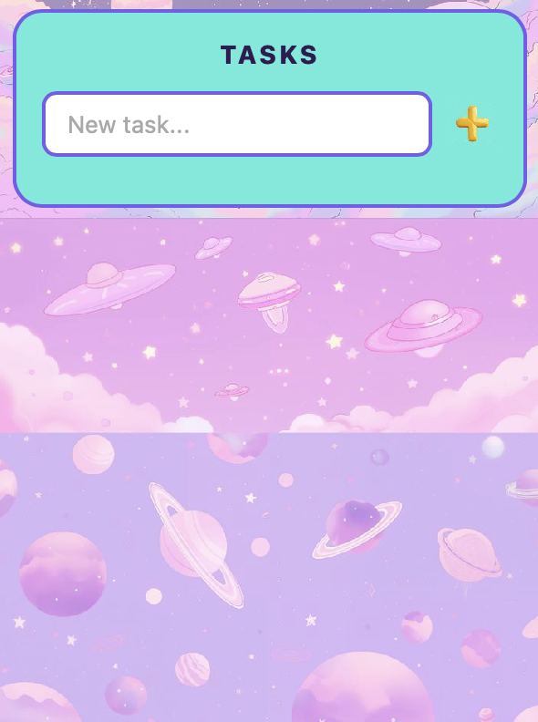

# Pixel Cloud To-Do Widget for Übersicht

A retro pixel-art to-do list desktop widget for macOS Übersicht. Background art credit to Victoja Borison (viktojadesigns.etsy.com)

## Features
- Add, complete, and delete tasks directly from your desktop
- Persistent task storage using browser `localStorage`
- Built-in multi-color pixel confetti celebration on task completion
- Cosmic aesthetic

## Requirements
- [Übersicht](https://tracesof.net/uebersicht/) on macOS

## Installation
1. Download or clone this repository.
2. Place the folder into your Übersicht widgets directory:
   `~/Library/Application Support/Übersicht/widgets/`
3. Refresh widgets from the Übersicht menu bar item.
